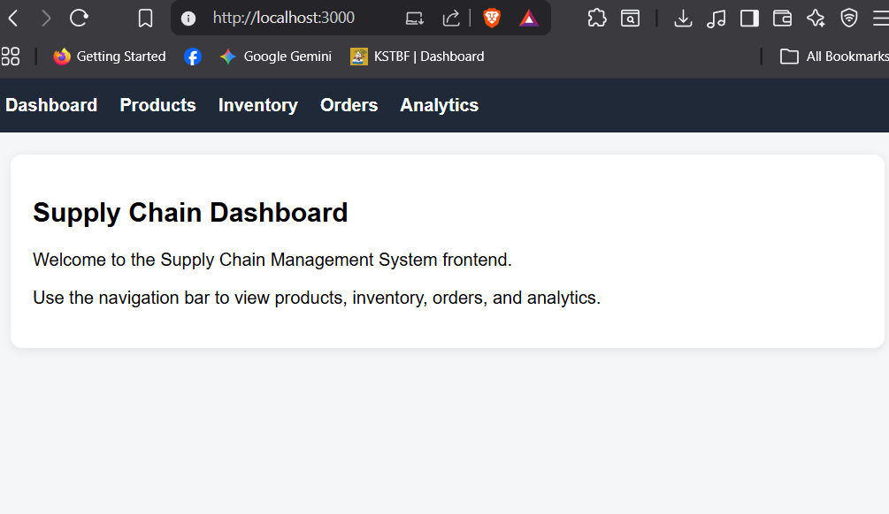
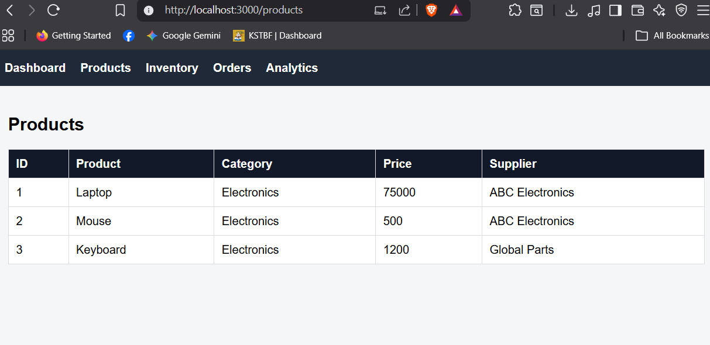
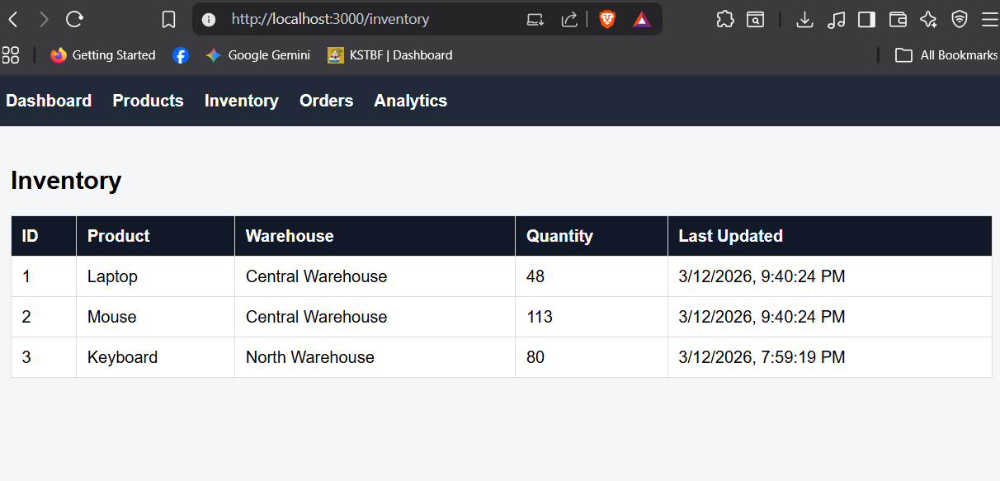
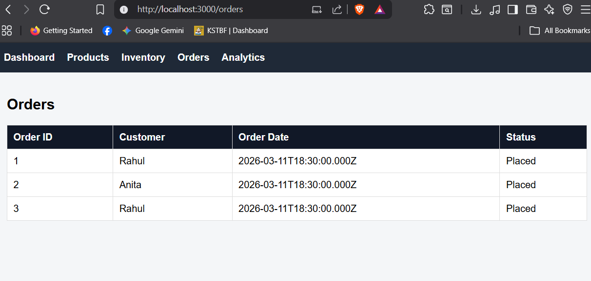
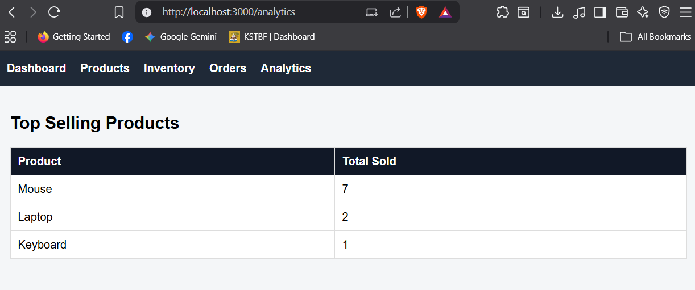
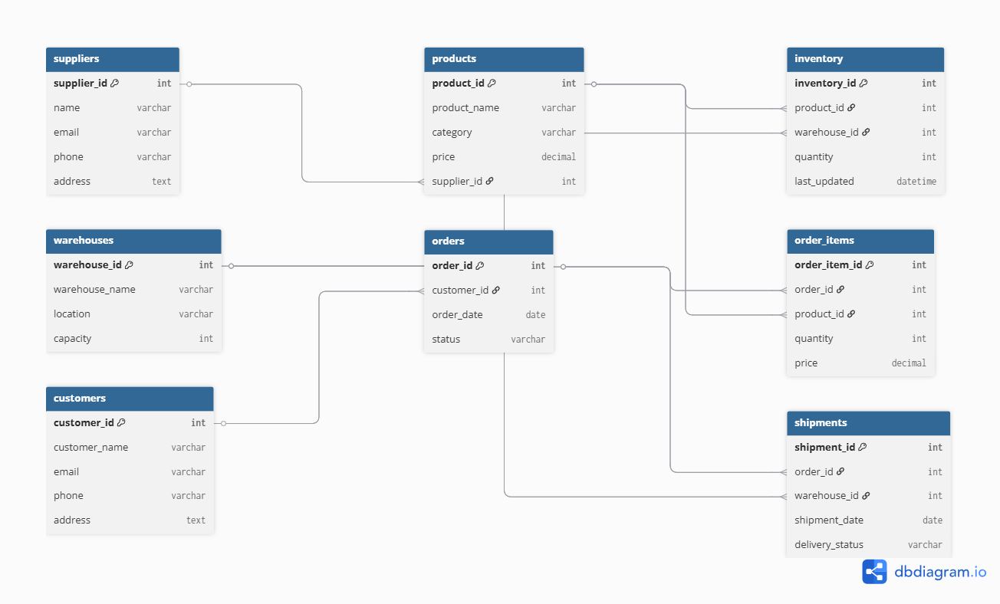

<div align="center">

# 🏭 Supply Chain Management System

### A full-stack web application to manage suppliers, products, inventory, orders, shipments, and analytics

<br/>


</div>

---

## 📸 Screenshots

| Dashboard | Products |
|:---------:|:--------:|
|  |  |

| Inventory | Orders | Analytics |
|:---------:|:------:|:---------:|
|  |  |  |

---

## ✨ Features

- 🔐 **JWT Authentication** — Secure register & login with `bcryptjs` password hashing
- 🏢 **Supplier Management** — Add and view suppliers with full contact details
- 📦 **Product Management** — Manage products by category, price, and supplier with keyword search
- 🏗️ **Inventory Tracking** — Real-time stock levels per warehouse via MySQL views
- 🛒 **Order Processing** — Place multi-item orders with full MySQL transaction support, inventory locking, and automatic shipment creation
- 🚚 **Shipment Tracking** — Track delivery status per order and warehouse
- 📊 **Analytics** — Top-selling product insights
- 🗄️ **Advanced MySQL** — Custom views, triggers, stored procedures, and performance indexes

---

## 🛠️ Tech Stack

### Backend

| Technology | Badge |
|---|---|
| Node.js — Runtime environment |  |
| Express.js — REST API framework |  |
| MySQL — Relational database |  |
| mysql2 — MySQL driver for Node |  |
| jsonwebtoken — JWT auth tokens |  |
| bcryptjs — Password hashing |  |
| express-validator — Input validation |  |
| Morgan — HTTP request logger |  |
| dotenv — Environment config |  |
| nodemon — Dev auto-restart |  |

### Frontend

| Technology | Badge |
|---|---|
| React 19 — UI framework |  |
| React Router DOM v7 — Routing |  |
| Axios — HTTP client |  |

---

## 📁 Project Structure

```
supply-chain-management-system/
├── server.js                  # Express app entry point
├── package.json
├── .env.example               # Environment variable template
├── .gitignore
│
├── config/
│   └── db.js                  # MySQL connection pool
│
├── controllers/               # Business logic layer
│   ├── authController.js
│   ├── supplierController.js
│   ├── productController.js
│   ├── inventoryController.js
│   ├── orderController.js
│   ├── shipmentController.js
│   └── analyticsController.js
│
├── routes/                    # API route definitions
│   ├── auth.js
│   ├── suppliers.js
│   ├── products.js
│   ├── inventory.js
│   ├── orders.js
│   ├── shipments.js
│   └── analytics.js
│
├── middleware/
│   ├── authMiddleware.js      # JWT verification
│   └── errorHandler.js        # Global error handler
│
├── sql/                       # Run these in order inside MySQL
│   ├── schema.sql             # Table definitions
│   ├── sample_data.sql        # Seed data
│   ├── indexes.sql            # Performance indexes
│   ├── views.sql              # SQL views
│   ├── triggers.sql           # Auto inventory trigger
│   └── procedures.sql         # Stored procedures
│
├── frontend/                  # React frontend
│   ├── src/
│   │   ├── App.js
│   │   └── components/
│   │       ├── Navbar.js
│   │       ├── Dashboard.js
│   │       ├── Products.js
│   │       ├── Inventory.js
│   │       ├── Orders.js
│   │       └── Analytics.js
│   └── package.json
│
├── docs/
│   └── ER_diagram.png
│
└── screenshots/
```

---

## 🗃️ ER Diagram



---

## ⚙️ Getting Started

### Prerequisites


---

### 1. Clone the Repository

```bash
git clone https://github.com/Dhanush-1213/supply-chain-management-system.git
cd supply-chain-management-system
```

---

### 2. Set Up Environment Variables

Create a `.env` file in the root directory based on `.env.example`:

```env
PORT=5000
DB_HOST=localhost
DB_USER=root
DB_PASSWORD=your_mysql_password
DB_NAME=supply_chain
DB_PORT=3306
JWT_SECRET=your_jwt_secret_key
```

---

### 3. Set Up the Database

Open **MySQL Workbench** and run the SQL files **in this exact order**:

| # | File | Purpose |
|---|------|---------|
| 1 | `sql/schema.sql` | Creates all tables |
| 2 | `sql/sample_data.sql` | Seeds initial data |
| 3 | `sql/indexes.sql` | Adds performance indexes |
| 4 | `sql/views.sql` | Creates SQL views |
| 5 | `sql/triggers.sql` | Adds inventory trigger |
| 6 | `sql/procedures.sql` | Creates stored procedures |

**MySQL Views:**
- `vw_product_supplier` — Products joined with supplier names
- `vw_order_summary` — Orders with customer info and total amount
- `vw_inventory_status` — Inventory with product and warehouse names

**Trigger:**
- `reduce_inventory_after_order` — Auto-reduces stock after an order item is inserted

**Stored Procedures:**
- `GetLowStock(min_qty)` — Lists products below a given stock threshold
- `GetCustomerOrders(cust_id)` — Returns full order history for a customer

---

### 4. Start the Backend

```bash
npm install
npm run dev        # Development with nodemon
# or
npm start          # Production
```

> Backend runs on → `http://localhost:5000`

---

### 5. Start the Frontend

```bash
cd frontend
npm install
npm start
```

> Frontend runs on → `http://localhost:3000`

---

## 📡 API Endpoints

> All protected routes require: `Authorization: Bearer <token>`

### 🔐 Auth

| Method | Endpoint | Auth | Description |
|--------|----------|:----:|-------------|
| `POST` | `/api/auth/register` | ❌ | Register a new user |
| `POST` | `/api/auth/login` | ❌ | Login and receive JWT |

### 🏢 Suppliers

| Method | Endpoint | Auth | Description |
|--------|----------|:----:|-------------|
| `GET` | `/api/suppliers` | ✅ | Get all suppliers |
| `POST` | `/api/suppliers` | ✅ | Add a new supplier |

### 📦 Products

| Method | Endpoint | Auth | Description |
|--------|----------|:----:|-------------|
| `GET` | `/api/products` | ✅ | Get all products |
| `POST` | `/api/products` | ✅ | Add a new product |
| `GET` | `/api/products/search?name=keyword` | ✅ | Search products by name |

### 🏗️ Inventory

| Method | Endpoint | Auth | Description |
|--------|----------|:----:|-------------|
| `GET` | `/api/inventory` | ✅ | Get all inventory records |

### 🛒 Orders

| Method | Endpoint | Auth | Description |
|--------|----------|:----:|-------------|
| `GET` | `/api/orders` | ✅ | Get all orders |
| `POST` | `/api/orders` | ✅ | Create a basic order |
| `POST` | `/api/orders/place` | ✅ | Place full order with transaction |

### 🚚 Shipments

| Method | Endpoint | Auth | Description |
|--------|----------|:----:|-------------|
| `GET` | `/api/shipments` | ✅ | Get all shipments |

### 📊 Analytics

| Method | Endpoint | Auth | Description |
|--------|----------|:----:|-------------|
| `GET` | `/api/analytics/top-products` | ✅ | Get top-selling products |

### ❤️ Health

| Method | Endpoint | Description |
|--------|----------|-------------|
| `GET` | `/api/health` | API health check |

---

## 📋 Sample Request Bodies

<details>
<summary><strong>📝 Register User</strong></summary>

```json
POST /api/auth/register
{
  "name": "Dhanush",
  "email": "dhanush@test.com",
  "password": "123456"
}
```
</details>

<details>
<summary><strong>🔑 Login</strong></summary>

```json
POST /api/auth/login
{
  "email": "dhanush@test.com",
  "password": "123456"
}
```
</details>

<details>
<summary><strong>📦 Add Product</strong></summary>

```json
POST /api/products
{
  "product_name": "Monitor",
  "category": "Electronics",
  "price": 12000,
  "supplier_id": 1
}
```
</details>

<details>
<summary><strong>🛒 Place Order (with full transaction)</strong></summary>

```json
POST /api/orders/place
{
  "customer_id": 1,
  "warehouse_id": 1,
  "items": [
    { "product_id": 1, "quantity": 1, "price": 75000 },
    { "product_id": 2, "quantity": 2, "price": 500 }
  ]
}
```

This endpoint:
1. Checks inventory availability with row-level locking (`FOR UPDATE`)
2. Inserts the order and all order items in a single transaction
3. Deducts inventory per item
4. Auto-creates a shipment record with status `Processing`
5. Rolls back entirely on any failure

</details>

---

## 🔮 Future Improvements

- [ ] Role-based access control (Admin / Staff)
- [ ] Dashboard KPI cards with Chart.js visualizations
- [ ] Docker + Docker Compose support
- [ ] Swagger / OpenAPI documentation
- [ ] Cloud deployment (Railway / Render / AWS)
- [ ] Pagination and filtering on list endpoints
- [ ] Email notifications for order updates

---

## 👤 Author

**Dhanush**
PES University
GitHub: [@Dhanush-1213](https://github.com/Dhanush-1213)

---

<div align="center">

⭐ If you found this project helpful, give it a star!

</div>
